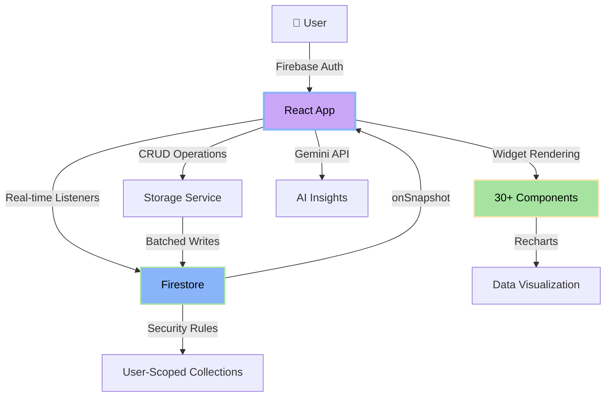

<div align="center">


<h3 align="center">
  
</h3>

<p align="center">
  <a href="https://nemesis-os.web.app">
    
  </a>
  
  
  
  
</p>

<p align="center">
  
  
  
</p>

</div>

---

<div align="center">

## 💀 *"The only difference between you and your goals is a properly configured dashboard."*

### [🌐 VISIT LIVE SITE](https://nemesis-os.web.app/)
</div>

---

## 🎯 What is NEMESIS?

**NEMESIS** isn't just another productivity app—it's a **complete reimagining of personal infrastructure**. This is what happens when you combine:

- 🧠 **A Developer's Obsession** with clean architecture
- ⚔️ **Stoic Philosophy** applied to systems design  
- 🔥 **Gaming UI/UX** sensibilities (think: Cyberpunk HUD meets Terminal)
- 📊 **Enterprise-Grade** data synchronization

Built for **cognitive athletes** who believe discipline scales through **automation**, not willpower. Your finances, habits, journal entries, and mental states—all rendered as **queryable data structures** in a **cloud-native terminal interface**.

<div align="center">

### 🚨 This is your life. Version-controlled. 🚨

</div>

---

## ⚡ Why NEMESIS Destroys the Competition

<table>
<tr>
<td width="50%" valign="top">

### 🏆 **Other Apps**
- ❌ Subscription paywalls every 5 features
- ❌ Locked to one device (no sync)  
- ❌ Bloated UI with 200 unnecessary animations  
- ❌ Your data held hostage on their servers  
- ❌ "Motivational quotes" instead of real analytics
- ❌ Built for casual users, not power users

</td>
<td width="50%" valign="top">

### ⚔️ **NEMESIS**
- ✅ **100% Free & Open Source** (MIT License)
- ✅ **Real-time Firebase Sync** across all devices
- ✅ **Terminal-Inspired Brutalism** (zero bloat)
- ✅ **Your data = Your Firebase project** (you own it)
- ✅ **GitHub-style Heatmaps** and streak tracking
- ✅ **Draggable Grid System** (customize everything)

</td>
</tr>
</table>

---

## 🎨 UI Philosophy: *"Cyberpunk Meets i3wm"*

<div align="center">

```ascii
╔══════════════════════════════════════════════════════════════════╗
║  NEMESIS VISUAL LANGUAGE                                         ║
╠══════════════════════════════════════════════════════════════════╣
║                                                                  ║
║  🎨 Catppuccin-Inspired Palettes (Dracula/Aura/Tokyo/Memento)   ║
║  🔠 JetBrains Mono (Terminal Monospace Everywhere)              ║
║  🪟 macOS-Style Window Controls (●●●) with Draggable Frames     ║
║  📐 Brutalist Grid Layouts (No Rounded Corners, Pure Function)  ║
║  🎯 Color-Coded by Intent:                                      ║
║     • Green (#a6e3a1)  → Income/Success/Completion               ║
║     • Red (#f38ba8)    → Expenses/Danger/Deletion                ║
║     • Blue (#89b4fa)   → Information/Tasks/Focus                 ║
║     • Mauve (#cba6f7)  → Accent/Active/Primary Actions           ║
║     • Yellow (#f9e2af) → Warnings/Time-Sensitive                 ║
║  ⚡ Zero Animations (Instant Feedback Only)                      ║
║  🖱️ Hover States Only on Interactive Elements                    ║
║                                                                  ║
╚══════════════════════════════════════════════════════════════════╝
```

</div>

---

## 🔥 Feature Arsenal

<details open>
<summary><h3>📊 1. DASHBOARD — Mission Control</h3></summary>

Your **real-time command center**. All subsystems aggregate here:

<table>
<tr>
<td width="33%">

**💰 WALLET**  
- Net balance (Income - Expenses)
- Live calculation from Firestore
- Color-coded: Green (profit) / Red (deficit)

</td>
<td width="33%">

**🎯 HABIT STATS**  
- Daily completion percentage
- Current vs longest streak
- Auto-reset at midnight

</td>
<td width="33%">

**🧠 MOOD TRACKER**  
- Latest journal mood (1-5 scale)
- 7-day trend visualization
- Average mood calculation

</td>
</tr>
<tr>
<td>

**💧 HYDRATION**  
- 8-cup daily goal tracker
- Increment/decrement controls
- Persistent across sessions

</td>
<td>

**⏱️ FOCUS TIMER**  
- Pomodoro-style sessions
- Adjustable duration (±1/±5 min)
- 5-second cooldown protection

</td>
<td>

**🌬️ BREATHING**  
- 4-4-4 resonance pattern
- Visual circle expansion
- Auto-cycling animations

</td>
</tr>
<tr>
<td>

**💭 DAILY QUOTE**  
- Randomized stoic wisdom
- 10+ curated quotes
- Jack of all trades philosophy

</td>
<td>

**✅ WELLNESS CHECKLIST**  
- Customizable daily protocols
- Per-day state tracking
- Add/delete tasks in edit mode

</td>
<td>

**📈 CASHFLOW CHART**  
- 7-day balance trend
- Area chart visualization
- Running total calculation

</td>
</tr>
<tr>
<td colspan="3">

**🎯 ACTIVE TASKS** — Live habit summary | **💳 RECENT TRANSACTIONS** — Last 5 financial events

</td>
</tr>
</table>

</details>

<details>
<summary><h3>💰 2. FINANCE — Forensic Capital Tracking</h3></summary>

Track **every rupee** with database-level precision:

| Feature | Description |
|---------|-------------|
| **Transaction Ledger** | Complete audit trail with category, date, notes, and delete capability |
| **Expense Breakdown** | Recharts pie chart showing category distribution |
| **Savings Goal** | Visual progress bar with editable target amount |
| **Recurring Subscriptions** | Monthly burn rate calculator (Netflix, Spotify, etc.) |
| **Overall Finance Matrix** | Multi-view analytics (All/Income/Expense/Subscription/Savings) |
| **Smart Categorization** | Auto-credit to savings account when category = "Savings" |
| **Date Stamping** | Historical timeline with ISO 8601 timestamps |

**Example Workflow:**
```typescript
// Add expense → Auto-categorized → Firestore sync → Real-time update across all devices
const newTransaction = {
  type: 'expense',
  amount: 1500,
  category: 'Groceries',
  notes: 'Monthly stock-up',
  date: new Date().toISOString()
}
StorageService.addFinance(userId, newTransaction);
```

</details>

<details>
<summary><h3>📖 3. JOURNAL — Vim-Inspired Cognitive Logging</h3></summary>

Because **thoughts are data structures** too:

- **VIM Buffer Editor** — Distraction-free writing (`INSERT MODE` placeholder)
- **Mood Scale (1-5)** — Numerical tracking per entry
- **History Archive** — Chronological browser with delete option
- **Mood Trend Chart** — 7-day LineChart visualization
- **Gratitude Log** — Separate practice tracker (❤️ icon-labeled entries)

**Why Vim-Inspired?**  
No WYSIWYG bloat. Just you, a textarea, and your thoughts. The interface gets out of your way.

</details>

<details>
<summary><h3>⚡ 4. HABITS — Protocol Execution Engine</h3></summary>

**Gamified consistency** with anti-spam protection:

<table>
<tr>
<td width="50%">

**Streak System**
- Current vs Longest streak tracking
- Auto-reset if >24hrs since last completion
- Midnight validation (checked today or yesterday)

**Cooldown Protection**
- 5-second lockout after execution
- Prevents accidental double-clicks
- Visual countdown display

</td>
<td width="50%">

**Consistency Grid**
- GitHub-style 70-day heatmap
- Color intensity based on executions/day:
  - 0: Gray (no activity)
  - 1-2: Light green
  - 3-5: Medium green  
  - 6+: Dark green
- Hover tooltips with date + count

**Process Manager**
- Add/delete habits
- Daily frequency (weekly coming soon)

</td>
</tr>
</table>

**Anti-Cheat Measures:**
```typescript
// Can't spam-click the "EXECUTE" button
if (cooldowns[habitId] && cooldowns[habitId] > 0) return;

// Streak only increments if consecutive days
const isConsecutive = lastCompleted === yesterday || lastCompleted === today;
const newStreak = isConsecutive ? habit.streak + 1 : 1;
```

</details>

<details>
<summary><h3>🤖 5. INSIGHTS — AI Neural Network</h3></summary>

**Gemini AI Integration** (Currently Stubbed for Firebase Architecture):

- Aggregates finances, journal, habits
- Natural language insight generation
- Weekly performance summaries
- 3-point actionable recommendations

**Why Stubbed?**  
In production Firebase, AI calls should happen via **Cloud Functions** to avoid downloading entire collections to the client. The UI is fully built—just needs backend hookup.

</details>

<details>
<summary><h3>⚙️ 6. SETTINGS — System Configuration</h3></summary>

| Setting | Options |
|---------|---------|
| **Theme Selector** | Dracula / Aura / Tokyo Night / Memento Mori |
| **User Profile** | Display UID, email, username |
| **Password Manager** | Secure credential updates with re-authentication |
| **Data Purge** | Nuclear option (Firebase deletion requires Cloud Function) |

**Security Features:**
- Re-authentication required for password changes
- Firebase Auth email/password flow
- Scoped Firestore rules (users can only access their own data)

</details>

---

## 🏗️ System Architecture

<div align="center">



</div>

### **Tech Stack Deep Dive**

<table>
<tr>
<td width="50%" valign="top">

#### ⚛️ **Frontend**
```yaml
Core:
  React: 18.3.1
  TypeScript: 5.8.3
  Vite: 6.2.0

UI Framework:
  Layout: React Grid Layout 1.4.4
  Styling: Tailwind (via CDN)
  Icons: Lucide React 0.294.0
  Charts: Recharts 2.12.7
  
Fonts:
  Primary: JetBrains Mono
  Fallback: Monospace
```

</td>
<td width="50%" valign="top">

#### 🔥 **Backend**
```yaml
Cloud Services:
  Database: Firestore (NoSQL)
  Auth: Firebase Auth
  Hosting: Firebase Hosting
  Analytics: Firebase Analytics

State Management:
  Method: Real-time Listeners
  Subscriptions: onSnapshot()
  Persistence: Cloud-first

Build & Deploy:
  Build: Vite (esbuild)
  Deploy: Firebase CLI
```

</td>
</tr>
</table>

### **Design Patterns**

| Pattern | Implementation |
|---------|----------------|
| **Real-time Sync** | Firestore `onSnapshot()` listeners in `useEffect` hooks |
| **Optimistic UI** | Instant local updates → Firestore confirmation |
| **Component Isolation** | 30+ widgets in `WidgetRegistry.tsx` (zero cross-dependencies) |
| **Type Safety** | Strict TypeScript (`"strict": true` in tsconfig) |
| **Custom Hooks** | `useUserId()` for Firebase Auth state |
| **Grid System** | React Grid Layout with `localStorage` fallback |
| **Security** | Firestore rules: `allow read, write: if request.auth.uid == userId` |

---

## 📊 Data Model

<details>
<summary><b>🔍 Click to see Firestore schema</b></summary>

```
firestore/
│
├── 📁 users/{userId}/
│   │
│   ├── 📄 [user document]
│   │   ├── theme: string (dracula|aura|tokyo|memento)
│   │   └── settings: { notifications: bool, sound: bool }
│   │
│   ├── 📁 userData/
│   │   ├── layout
│   │   │   └── windows: WindowState[]
│   │   ├── savings
│   │   │   ├── goal: number
│   │   │   └── current: number
│   │   ├── gratitude
│   │   │   └── items: string[]
│   │   ├── wellnessConfig
│   │   │   └── items: string[]
│   │   └── sleep
│   │       └── lastHours: string | null
│   │
│   ├── 📁 finances/{financeId}
│   │   ├── type: 'income' | 'expense'
│   │   ├── amount: number
│   │   ├── category: string
│   │   ├── notes?: string
│   │   └── date: ISO8601 string
│   │
│   ├── 📁 journal/{journalId}
│   │   ├── mood: number (1-5)
│   │   ├── text: string
│   │   └── date: ISO8601 string
│   │
│   ├── 📁 habits/{habitId}
│   │   ├── name: string
│   │   ├── frequency: 'daily' | 'weekly'
│   │   ├── streak: number
│   │   ├── longestStreak: number
│   │   ├── lastCompletedDate: ISO8601 | null
│   │   └── history: ISO8601[]
│   │
│   ├── 📁 subscriptions/{subId}
│   │   ├── name: string
│   │   └── cost: number
│   │
│   ├── 📁 hydrationLog/{dateKey}
│   │   └── count: number
│   │
│   └── 📁 wellnessLog/{dateKey}
│       └── state: { [item: string]: boolean }
```

</details>

---

## 🚀 Installation & Deployment

### **Prerequisites**
```bash
✅ Node.js >= 18.0.0
✅ npm >= 8.0.0
✅ Firebase CLI (npm install -g firebase-tools)
✅ Git
```

### **Quick Start (Local Development)**

<details open>
<summary><b>📦 Step-by-Step Setup</b></summary>

```bash
# 1. Clone the repository
git clone https://github.com/yourusername/nemesis-os.git
cd nemesis-os

# 2. Install dependencies
npm install

# 3. Configure Firebase
# Create project at https://console.firebase.google.com/
# Enable: Authentication (Email/Password), Firestore, Hosting

# 4. Update Firebase config in services/firebase.ts
# Replace with your project credentials:
const firebaseConfig = {
  apiKey: "YOUR_API_KEY",
  authDomain: "your-project.firebaseapp.com",
  projectId: "your-project-id",
  storageBucket: "your-project.appspot.com",
  messagingSenderId: "YOUR_SENDER_ID",
  appId: "YOUR_APP_ID",
  measurementId: "YOUR_MEASUREMENT_ID"
};

# 5. Set up Firestore Security Rules
firebase deploy --only firestore:rules

# 6. Start development server
npm run dev
# → http://localhost:3000

# 7. Build for production
npm run build

# 8. Deploy to Firebase Hosting
firebase login
firebase init hosting  # Select 'dist' as public directory
firebase deploy
```

</details>

### **Firestore Security Rules** (CRITICAL)

<details>
<summary><b>🔒 Click to see production-ready rules</b></summary>

Create `firestore.rules`:

```javascript
rules_version = '2';
service cloud.firestore {
  match /databases/{database}/documents {
    
    // Helper function: Check if user is authenticated
    function isAuthenticated() {
      return request.auth != null;
    }
    
    // Helper function: Check if user owns the resource
    function isOwner(userId) {
      return request.auth.uid == userId;
    }
    
    // User profile documents
    match /users/{userId} {
      allow read, write: if isAuthenticated() && isOwner(userId);
      
      // User subcollections (finances, journal, habits, etc.)
      match /{subcollection}/{document=**} {
        allow read, write: if isAuthenticated() && isOwner(userId);
      }
    }
  }
}
```

**Deploy rules:**
```bash
firebase deploy --only firestore:rules
```

</details>

### **Environment Variables** (Optional - for AI features)

<details>
<summary><b>⚙️ Gemini AI Setup</b></summary>

Create `.env.local`:

```bash
VITE_GEMINI_API_KEY=your_gemini_api_key_here
```

Get your API key from [Google AI Studio](https://makersuite.google.com/app/apikey)

**Note:** AI Insights currently stubbed for Firebase architecture. Production implementation requires Cloud Functions.

</details>

---

## 📂 Project Structure

<details>
<summary><b>🗂️ Detailed File Tree</b></summary>

```
nemesis-os/
│
├── 📁 components/
│   ├── Sidebar.tsx                    # Left navigation dock with workspace switcher
│   ├── UIComponents.tsx               # Reusable primitives:
│   │                                   #   • Button (4 variants)
│   │                                   #   • Input (with labels)
│   │                                   #   • Card (with header/action slot)
│   │                                   #   • Badge (4 color schemes)
│   ├── WindowFrame.tsx                # Draggable window wrapper with:
│   │                                   #   • macOS-style controls (●●●)
│   │                                   #   • Maximize/minimize states
│   │                                   #   • Resize handle (bottom-right)
│   └── WidgetRegistry.tsx             # 30+ widgets organized by workspace:
│                                       #   • Dashboard (10 widgets)
│                                       #   • Finance (6 widgets)
│                                       #   • Journal (4 widgets)
│                                       #   • Habits (3 widgets)
│                                       #   • Insights (1 widget)
│                                       #   • Settings (1 widget)
│
├── 📁 pages/ (LEGACY - now widget-based)
│   ├── Dashboard.tsx
│   ├── Finance.tsx
│   ├── Journal.tsx
│   ├── Habits.tsx
│   ├── Insights.tsx
│   └── Settings.tsx
│
├── 📁 services/
│   ├── firebase.ts                    # Firebase initialization
│   │                                   #   • initializeApp()
│   │                                   #   • getAuth(), getFirestore()
│   │                                   #   • getAnalytics()
│   ├── storageService.ts              # Firestore CRUD operations:
│   │                                   #   • subscribeToFinances()
│   │                                   #   • addJournal()
│   │                                   #   • updateHabit()
│   │                                   #   • saveLayout()
│   │                                   #   • 20+ methods
│   └── geminiService.ts               # AI integration (stubbed)
│
├── 📄 types.ts                        # TypeScript interfaces:
│                                       #   • WindowState
│                                       #   • FinanceData
│                                       #   • Habit
│                                       #   • JournalEntry
│                                       #   • 10+ more
│
├── 📄 App.tsx                         # Main window manager:
│                                       #   • Auth state management
│                                       #   • Grid layout controller
│                                       #   • Workspace switcher
│                                       #   • Theme applier
│
├── 📄 index.tsx                       # React DOM renderer
├── 📄 index.html                      # HTML shell with:
│                                       #   • Tailwind CDN
│                                       #   • JetBrains Mono font
│                                       #   • CSS variable themes
│                                       #   • Import maps for ESM
│
├── 📄 vite.config.ts                  # Build configuration
├── 📄 tsconfig.json                   # TypeScript strict mode
├── 📄 firebase.json                   # Firebase Hosting config
├── 📄 .firebaserc                     # Firebase project link
├── 📄 firestore.rules                 # Security rules
├── 📄 firestore.indexes.json          # Composite indexes (none needed)
└── 📄 package.json                    # Dependencies & scripts
```

</details>

---

## 🎮 Usage Guide

### **First-Time Setup**

<table>
<tr>
<td width="33%" align="center">

**1️⃣ Create Account**


Register with email + password  
(Firebase Auth handles security)

</td>
<td width="33%" align="center">

**2️⃣ Customize Layout**


Click 🔓 **EDITING** button  
Drag & resize windows to preference

</td>
<td width="33%" align="center">

**3️⃣ Select Theme**


Settings → **VISUAL_MATRIX**  
Choose: Dracula/Aura/Tokyo/Memento

</td>
</tr>
</table>

### **Daily Workflow Examples**

<details>
<summary><b>📊 Financial Tracking</b></summary>

```typescript
// Morning Routine
1. Finance → ADD_ENTRY widget
2. Select type: EXPENSE / INCOME
3. Enter amount: 500
4. Category: "Coffee"
5. Note: "Starbucks - morning meeting"
6. Date: Auto-filled (today)
7. COMMIT RECORD
   ↓
   Real-time sync to Firestore
   ↓
   LEDGER.CSV updates instantly
   ↓
   EXPENSE_MATRIX pie chart recalculates
   ↓
   WALLET widget shows new balance
```

**Pro Tip:** Use category "Savings" to auto-credit your savings goal!

</details>

<details>
<summary><b>⚡ Habit Execution</b></summary>

```typescript
// Evening Check-In
1. Habits → ACTIVE_PROTOCOLS widget
2. Find today's protocols (e.g., "Read 10 pages")
3. Click EXECUTE button
   ↓
   Streak increments (+1)
   ↓
   5-second cooldown activates
   ↓
   CONSISTENCY_GRID updates (green square for today)
   ↓
   Dashboard → HABIT_STATS refreshes (% completion)
```

**Anti-Cheat:** Can't spam EXECUTE. Cooldown + midnight validation prevents abuse.

</details>

<details>
<summary><b>📖 Journal Entry</b></summary>

```typescript
// Night Reflection
1. Journal → VIM_BUFFER widget
2. Select mood: 1-5 scale (1=bad, 5=great)
3. Write entry in textarea ("INSERT MODE")
4. Click WRITE AND QUIT
   ↓
   Timestamped entry saved
   ↓
   HISTORY widget shows chronological list
   ↓
   MOOD_TREND chart updates 7-day line graph
```

**Vim Inspiration:** No formatting tools. Just raw text. Gets out of your way.

</details>

### **Keyboard Shortcuts**

| Shortcut | Action |
|----------|--------|
| `Enter` | Submit forms (Add Entry, New Habit, etc.) |
| `Esc` | Close maximized windows (coming soon) |
| `Ctrl + S` | Save journal entry (coming soon) |

---

## 🔐 Security & Privacy

<div align="center">

### 🛡️ **Your Data. Your Server. Your Rules.**

</div>

| Feature | Implementation |
|---------|----------------|
| **🔒 Authentication** | Firebase Auth (OAuth 2.0 + bcrypt password hashing) |
| **🗃️ Database Rules** | Scoped Firestore: `userId == request.auth.uid` |
| **🔑 Password Management** | Re-authentication required for updates |
| **🚫 No Third-Party Tracking** | Zero analytics SDKs (optional Firebase Analytics) |
| **📱 Cross-Device Sync** | HTTPS-only communication |
| **💾 Data Ownership** | You control the Firebase project |
| **🗑️ Right to Delete** | Full account purge via Settings (requires Cloud Function) |

**Privacy Guarantee:**  
NEMESIS doesn't sell data. We don't even *have* your data—it's in *your* Firebase project. Open-source = full transparency.

---

## 🖼️ Screenshots

<div align="center">

<table>
<tr>
<td width="50%" align="center">

### 📊 Dashboard — Mission Control

*Real-time widgets with draggable grid system*

</td>
<td width="50%" align="center">

### 💰 Finance — Audit Trail

*Complete transaction ledger + analytics*

</td>
</tr>
<tr>
<td width="50%" align="center">

### 📖 Journal — Vim Buffer

*Distraction-free writing + mood tracking*

</td>
<td width="50%" align="center">

### ⚡ Habits — Consistency Grid

*GitHub-style heatmap + streak system*

</td>
</tr>
</table>

<sup>*Note: Replace placeholder images with actual screenshots*</sup>

</div>

---

## 🗺️ Roadmap

<div align="center">

### 🚀 **From MVP to Empire**

</div>

<table>
<tr>
<td width="25%" valign="top">

### **Q1 2026** ✅
- [x] Core widget system
- [x] Firebase real-time sync
- [x] 4 theme variants
- [x] Habit streak tracking
- [x] Finance categorization
- [x] Grid layout persistence
- [x] Mobile-responsive sidebar

</td>
<td width="25%" valign="top">

### **Q2 2026** 🔨
- [ ] **Dark Mode Auto-Switch** (sunset-based)
- [ ] **Keyboard Shortcuts** (Vim-style navigation)
- [ ] **Export to CSV/JSON** (full data backup)
- [ ] **Google Calendar Sync** (habit reminders)
- [ ] **Voice Memo Journaling** (Web Speech API)
- [ ] **Telegram Bot** (daily summary notifications)

</td>
<td width="25%" valign="top">

### **Q3 2026** 🌟
- [ ] **Mobile App** (React Native + shared codebase)
- [ ] **Obsidian Plugin** (bidirectional sync)
- [ ] **API Webhooks** (IFTTT integration)
- [ ] **Apple Health Sync** (sleep/steps tracking)
- [ ] **AI Weekly Reports** (Gemini via Cloud Functions)
- [ ] **Collaborative Habits** (shared goals with friends)

</td>
<td width="25%" valign="top">

### **Q4 2026** 🚀
- [ ] **Multi-User Accounts** (family plans)
- [ ] **Public Dashboard Sharing** (read-only links)
- [ ] **Biometric Integration** (Google Fit)
- [ ] **Custom Widget Builder** (user-created components)
- [ ] **Self-Hosted Option** (Docker image)
- [ ] **E2E Encryption** (client-side before Firestore)

</td>
</tr>
</table>

### **Feature Requests**

Want something specific? [Open an issue](https://github.com/Siddharthk17/nemesis-os/issues/new?template=feature_request.md) with:
- 🎯 **Use Case** — Why you need it
- 💡 **Proposed Solution** — How it should work
- 🎨 **UI Mockup** — Visual reference (optional)

---

## 🤝 Contributing

<div align="center">

### 🔥 **We Don't Gate-Keep. We Collaborate.** 🔥

</div>

NEMESIS is **100% open-source**. PRs are welcome for:

<table>
<tr>
<td width="33%">

**🐛 Bug Fixes**
- Firestore sync issues
- UI glitches
- Layout persistence bugs
- Streak calculation errors

</td>
<td width="33%">

**✨ New Features**
- Additional widgets
- New theme palettes
- Chart visualizations
- Productivity tools

</td>
<td width="33%">

**⚡ Optimizations**
- Firestore query batching
- Component re-render prevention
- Bundle size reduction
- Lighthouse score improvements

</td>
</tr>
</table>

### **Development Guidelines**

<details>
<summary><b>📋 Contribution Checklist</b></summary>

**Before Submitting:**
- [ ] Code follows existing style (PascalCase components, camelCase functions)
- [ ] TypeScript strict mode passes (`no 'any' types`)
- [ ] Firestore operations tested in isolation
- [ ] No `console.log()` left in production code
- [ ] Widget is self-contained (no cross-widget state dependencies)
- [ ] Changes documented in PR description

**Preferred PR Format:**
```markdown
## 🎯 Problem
[Describe the issue or feature gap]

## ✅ Solution
[Explain your implementation]

## 🖼️ Screenshots (if UI change)
[Before/After images]

## 🧪 Testing Done
- [ ] Local dev server (`npm run dev`)
- [ ] Production build (`npm run build`)
- [ ] Firebase emulator (if Firestore changes)
```

</details>

### **Good First Issues**

Looking to contribute? Start here:
- 🟢 [Add new theme palette](https://github.com/Siddharthk17/nemesis-os/issues)
- 🟢 [Create hydration reminder notification](https://github.com/Siddharthk17/nemesis-os/issues)
- 🟢 [Build CSV export feature](https://github.com/Siddharthk17/nemesis-os/issues)
- 🟢 [Implement keyboard shortcuts](https://github.com/Siddharthk17/nemesis-os/issues)

---

## 📜 License

<div align="center">

```
MIT License

Copyright (c) 2026 NEMESIS Contributors

Permission is hereby granted, free of charge, to any person obtaining a copy
of this software and associated documentation files (the "Software"), to deal
in the Software without restriction, including without limitation the rights
to use, copy, modify, merge, publish, distribute, sublicense, and/or sell
copies of the Software, and to permit persons to whom the Software is
furnished to do so, subject to the following conditions:

The above copyright notice and this permission notice shall be included in all
copies or substantial portions of the Software.

THE SOFTWARE IS PROVIDED "AS IS", WITHOUT WARRANTY OF ANY KIND, EXPRESS OR
IMPLIED, INCLUDING BUT NOT LIMITED TO THE WARRANTIES OF MERCHANTABILITY,
FITNESS FOR A PARTICULAR PURPOSE AND NONINFRINGEMENT. IN NO EVENT SHALL THE
AUTHORS OR COPYRIGHT HOLDERS BE LIABLE FOR ANY CLAIM, DAMAGES OR OTHER
LIABILITY, WHETHER IN AN ACTION OF CONTRACT, TORT OR OTHERWISE, ARISING FROM,
OUT OF OR IN CONNECTION WITH THE SOFTWARE OR THE USE OR OTHER DEALINGS IN THE
SOFTWARE.
```

**TL;DR:** Do whatever you want. Just don't sue us.

</div>

---

## 🙏 Acknowledgments

<div align="center">

### **Standing on the Shoulders of Giants**

</div>

<table>
<tr>
<td width="50%" valign="top">

#### 🛠️ **Technical Foundations**
- **[Firebase](https://firebase.google.com/)** — For building the real-time sync engine that makes NEMESIS possible
- **[React Team](https://react.dev/)** — For the component model that changed frontend forever
- **[Vite](https://vitejs.dev/)** — For build speeds that make Webpack look ancient
- **[React Grid Layout](https://github.com/react-grid-layout/react-grid-layout)** — For the window management magic
- **[Recharts](https://recharts.org/)** — For turning numbers into beautiful stories
- **[Lucide Icons](https://lucide.dev/)** — For making every pixel perfect
- **[Tailwind CSS](https://tailwindcss.com/)** — For utility-first styling done right

</td>
<td width="50%" valign="top">

#### 📚 **Philosophical Influences**
- **Marcus Aurelius** — *Meditations* (Stoic daily practice)
- **Epictetus** — *Enchiridion* (Control what you can)
- **David Allen** — *Getting Things Done* (Capture everything)
- **James Clear** — *Atomic Habits* (1% daily improvements)
- **Cal Newport** — *Deep Work* (Focus is the new IQ)
- **Nir Eyal** — *Indistractable* (Master your triggers)
- **Andrew Huberman** — *Huberman Lab* (Neuroscience of habits)

</td>
</tr>
</table>

#### 🎨 **Design Inspiration**
- **[Catppuccin](https://github.com/catppuccin/catppuccin)** — For the color palette that started a revolution
- **[Dracula Theme](https://draculatheme.com/)** — For proving dark mode is superior
- **[i3wm](https://i3wm.org/)** — For tiling window manager philosophy
- **[Cyberpunk 2077](https://www.cyberpunk.net/)** — For HUD design that looks like the future
- **[Neovim](https://neovim.io/)** — For terminal aesthetics and Vim keybindings

#### 🌐 **Community**
- **r/productivity** — For constant debates on systems vs habits
- **Hacker News** — For bikeshedding about Firebase vs Supabase
- **IndieHackers** — For proving you don't need VC funding
- **GitHub Community** — For showing that open source still wins

---

## 💬 Support & Contact

<div align="center">

<table>
<tr>
<td align="center" width="33%">

### 🐛 **Bug Reports**
Found a bug? Firestore not syncing?

[Open an Issue →](https://github.com/Siddharthk17/nemesis-os/issues/new?template=bug_report.md)

</td>
<td align="center" width="33%">

### 💡 **Feature Requests**
Have an idea? Want a new widget?

[Start a Discussion →](https://github.com/Siddharthk17/nemesis-os/discussions/new)

</td>
<td align="center" width="33%">

### 📧 **Direct Contact**
Need private support?

[Email Me →](mailto:siddharthkakade7777@gmail.com)

</td>
</tr>
</table>

</div>

---

## ⭐ Show Your Support

<div align="center">

### **If NEMESIS helped you get your sh*t together, consider:**

<table>
<tr>
<td align="center">

**⭐ Star this repo**  
Help others discover it

</td>
<td align="center">

**🍴 Fork & customize**  
Make it your own

</td>
</tr>
</table>

<br/>


</div>

---

## 📈 Project Stats

<div align="center">


</div>

---

<div align="center">

```
╔════════════════════════════════════════════════════════════════════╗
║                                                                    ║
║  "The best time to plant a tree was 20 years ago.                  ║
║   The second best time is now.                                     ║
║   The third best time is right after you deploy NEMESIS."          ║
║                                                                    ║
║                                      — Ancient Developer Proverb   ║
║                                                                    ║
╚════════════════════════════════════════════════════════════════════╝
```

<br/>

### **Built with ❤️, ☕, and 🔥 by developers who treat life like a codebase**

<br/>

**Current Status:** `[ PRODUCTION READY ]` | **Version:** `v1.0.0` | **Last Updated:** January 2026

<br/>


<br/><br/>

<sup>Made for the 1% who read READMEs all the way to the end. You're one of us now.</sup>

<br/>


</div>
